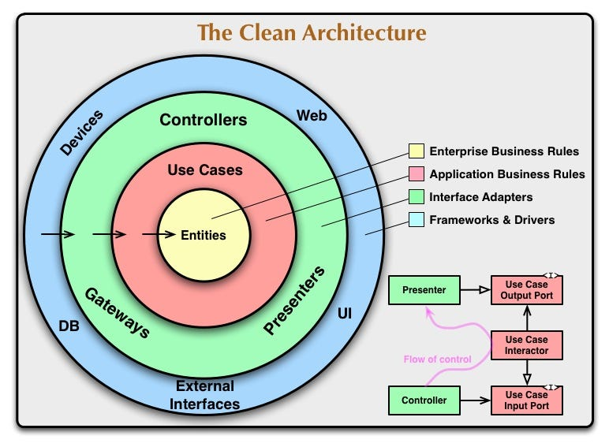
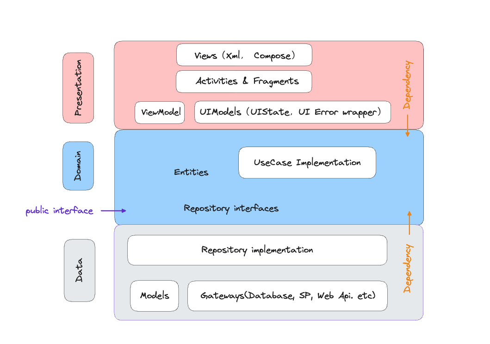
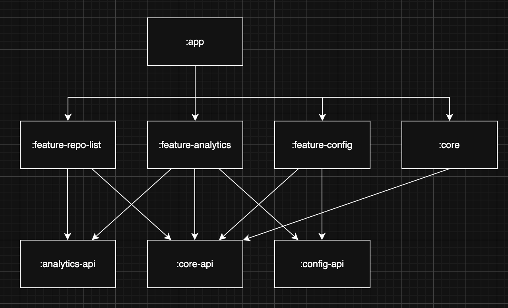

# GitHub Repo Explorer

A modern Android application that explores public GitHub repositories.

## 🚀 Features

- **Public Repo Discovery**: Fetches and displays a list of public repositories from the GitHub API.
- **Infinite Scrolling**: Implements pagination using the `Link` header provided by GitHub (using `rel="next"`).
- **Local Persistence**: Users can bookmark repositories which are saved locally using Room.
- **Rich Sorting & Grouping**:
    - Sort repositories by star count.
    - Group repositories by programming language.
- **Graceful Error Handling**: 
    - Handles network timeouts, no internet, and API rate limiting.
    - Displays user-friendly error messages and snackbars for background updates.
- **Loading States**: Includes loading indicators for both initial loads and pagination.

## 🛠 Tech Stack

- **UI**: Jetpack Compose.
- **Architecture**: MVI with Clean Architecture principles.
- **Dependency Injection**: Hilt.
- **Networking**: Retrofit + OkHttp.
- **Database**: Room.
- **Pagination**: Paging 3 (RemoteMediator for offline-first support).
- **Image Loading**: Coil.
- **Testing**: 
    - **Unit Tests**.
    - **UI Tests**.

## 🏗 Architectural Decisions & Assumptions
### Clean architecture 
General 

 

Android 

### Modularization proposal
In our modularization proposal is based on three module types: `app`, `feature`, and `api`. 
We will apply the following module rules:
1. `app` module will be at the top level, but it may depend on both `feature` and `api` module. 
2. `feature` modules cannot depend on the `app` module or other `feature` modules, but they may depend on `api` modules.
3. `api` module should not depend on any other modules.

Diagram of types and rules


### Offline-First with Paging 3
I chose to implement `RemoteMediator` with Paging 3. This ensures a seamless user experience where cached data is displayed immediately, and new data is merged from the network. Bookmarks are preserved even when the remote data is refreshed or cleared.

### GitHub API Pagination
As per the requirement, the app does not guess page numbers. It extracts the `next` URL directly from the HTTP `Link` header. I implemented a custom `LinkHeaderParser` to handle this robustly.

### Error Handling Strategy
- **Terminal Errors**: If the initial load fails (e.g., No Internet), a snackbar with failed message will show.
- **Transient Errors**: If a background "enrichment" call (fetching extra details like star counts) fails due to rate limiting, the error is shown via a Snackbar to avoid interrupting the user's scroll.

### Data Enrichment
The primary GitHub `/repositories` endpoint provides limited data. To satisfy the bonus requirements (stars, languages), the app perform "on-demand enrichment." As items become visible on screen, the app fetches detailed info for those specific repositories and updates the local database.

## 🧪 Testing Consideration

The project demonstrates a comprehensive testing strategy:
- **Mappers**: Verified data transformation between API, Database, Domain layers, and Domain layer to Presentation layer.
- **Remote Layer**: Tested Interceptors (headers) and Link header parsing.
- **Repository**: Verified coordination between remote and local data sources, including error handling.
- **ViewModel**: Tested UI state transitions and user actions (sorting, bookmarking).
- **UI Tests**: Instrumented tests for `RepoListScreen` states and `RepoItem` interactions.

## 🔧 Setup

1.  Clone the repository.
2.  (Optional) Add a `GITHUB_TOKEN` to `local.properties` to increase the API rate limit:
    ```properties
    GITHUB_TOKEN=your_token_here
    ```
3.  Build and run the app.

## 🚀 Future Improvements

As this is a technical demo, several areas could be further enhanced for a production-ready environment:

- **UI/UX Polish**: While the core functionality is present, the user experience could be improved with more animations (e.g., Shared Element Transitions), a dedicated detail screen, and more refined shimmer loading states and error screens.
- **Modularization**: For the sake of simplicity in this assessment, the project is contained within a single `:app` module. In a real-world, large-scale application, I would separate features into their own modules (e.g., `:feature:list`, `:core:database`, `:core:network`) to improve build times and separation of concerns. The modularization strategy graph is provided in the architecture part.
- **Comprehensive Error Handling**: The current implementation focuses primarily on network-related errors. Future iterations should include handling for local storage failures (e.g., Room disk-full or migration errors) and more robust edge-case handling for corrupted local cache.
- **More feature**: Adding folk, contribute even more.

---
**Author**: Mia Truong
